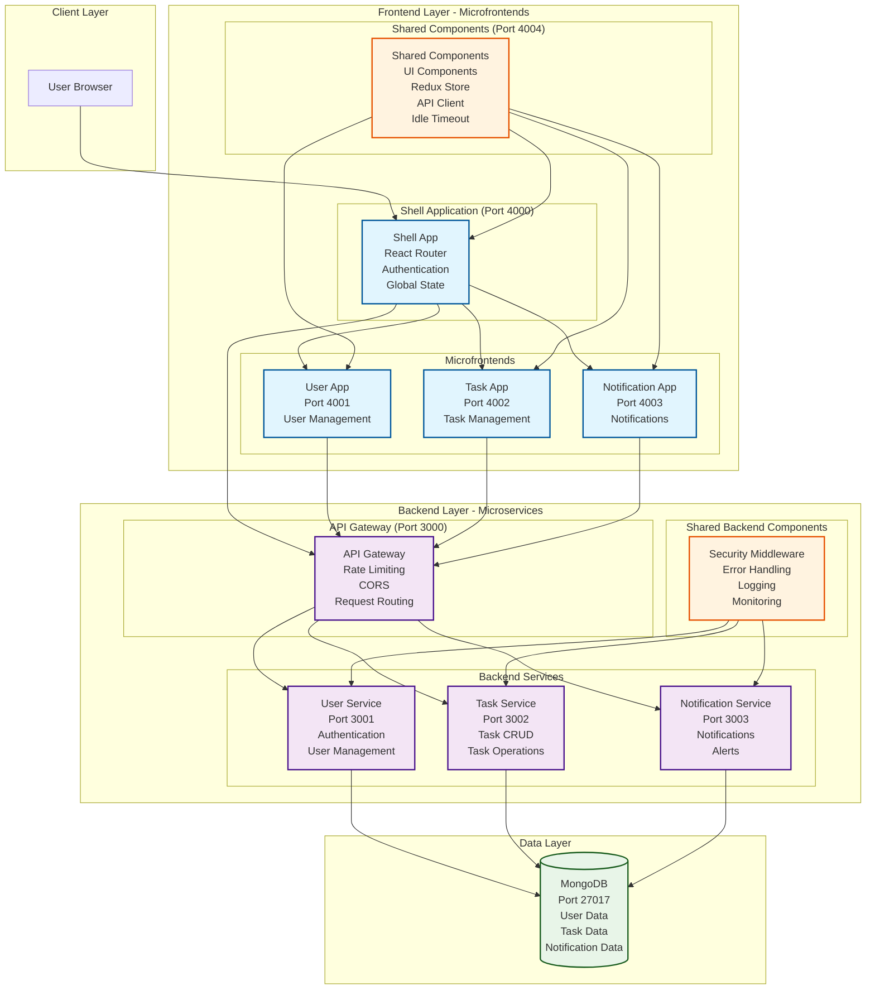
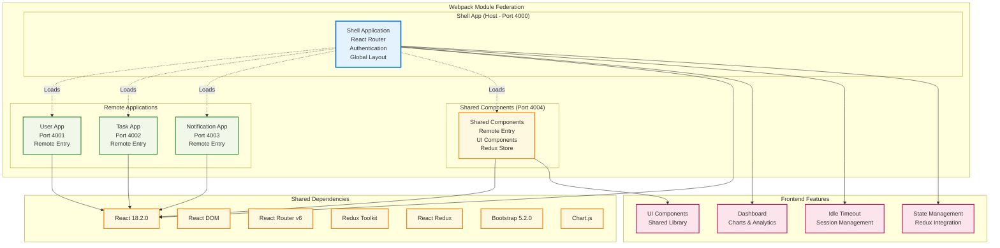
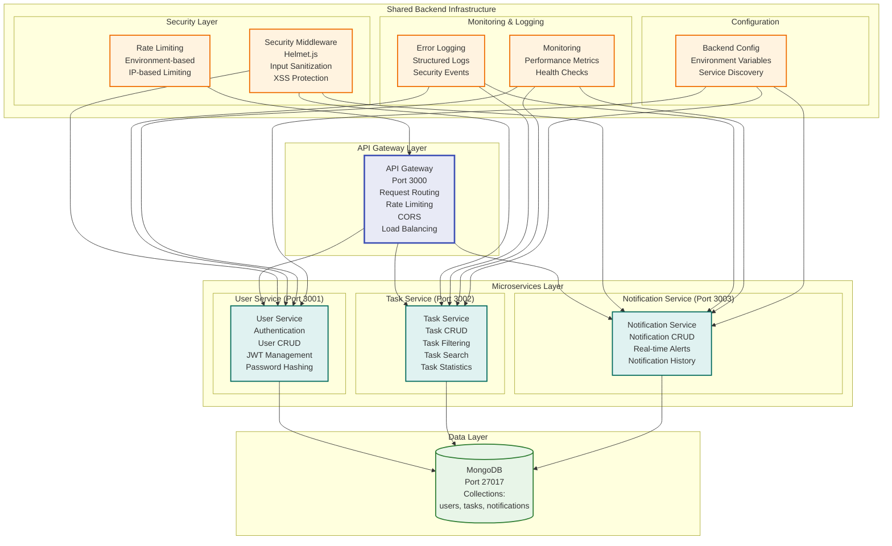
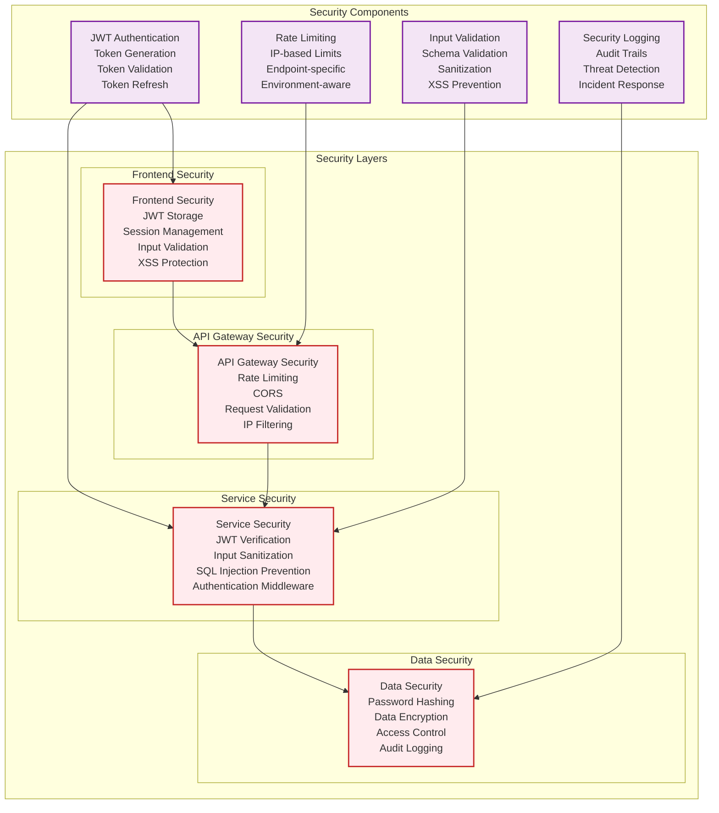
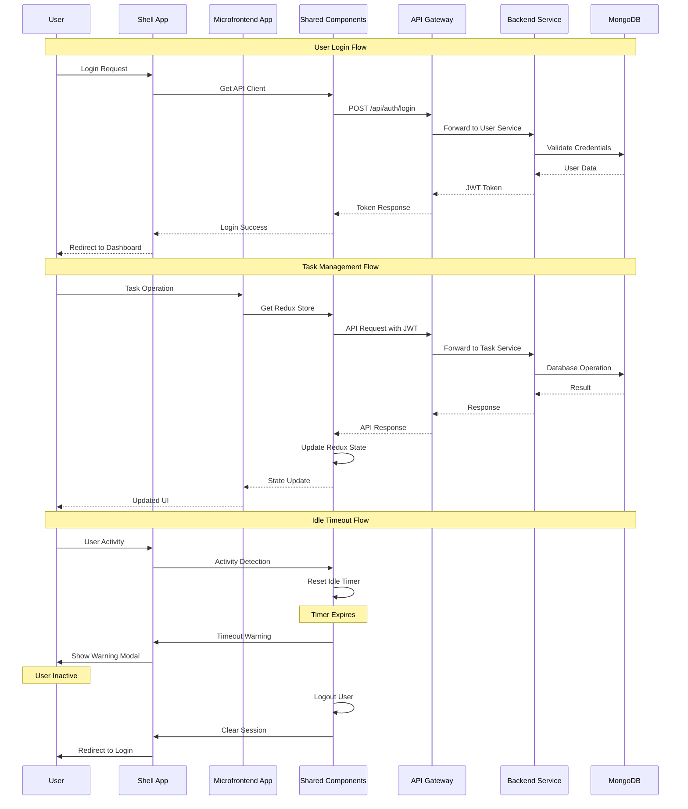
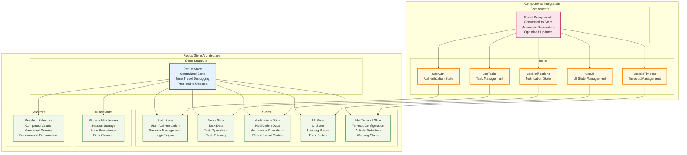
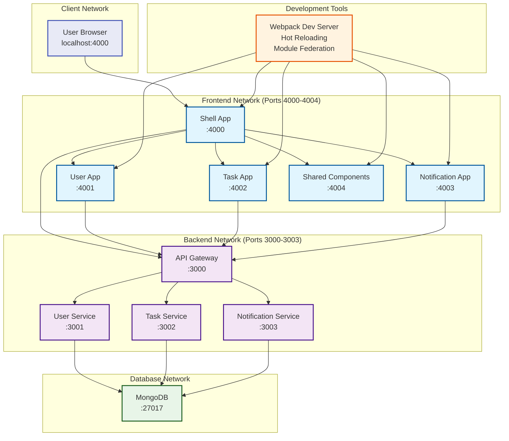
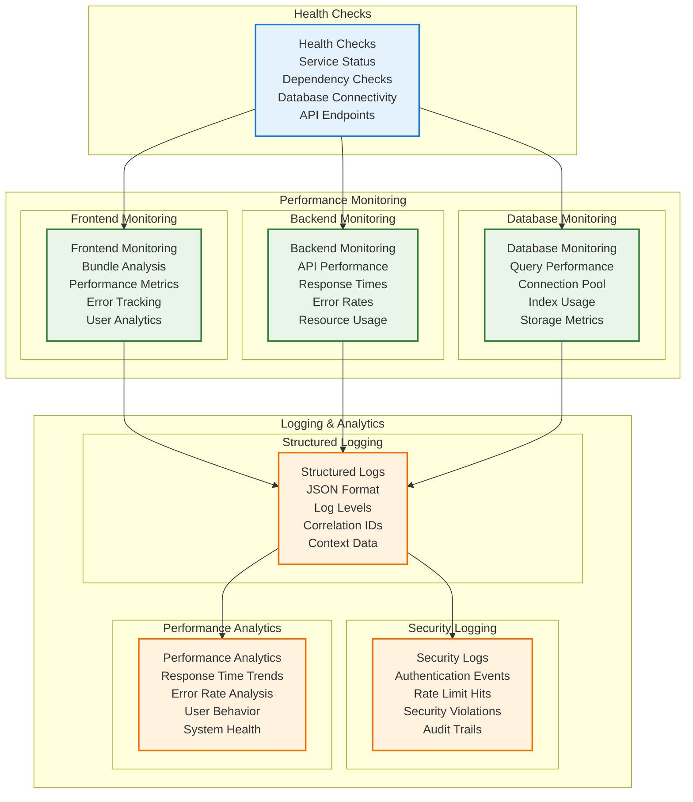
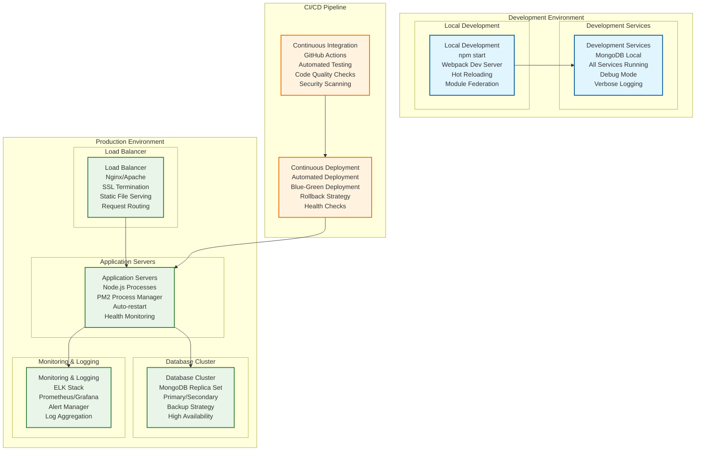

# Task Management System - Complete Architecture Diagram

## 🏗️ System Overview

This document contains comprehensive architecture diagrams for the Task Management System, showing the complete microfrontend and microservices architecture.

## 📊 Complete System Architecture

## 🔄 Frontend Microfrontend Architecture

## 🏢 Backend Microservices Architecture

## 🔐 Security Architecture

## 📊 Data Flow Architecture

## 🔄 State Management Architecture

## 🌐 Network Architecture

## 📈 Performance & Monitoring Architecture

## 🚀 Deployment Architecture

## 📋 Architecture Summary

### **Frontend Architecture**
- **Microfrontend Pattern**: Shell app orchestrates independent microfrontends
- **Module Federation**: Webpack 5 enables dynamic loading of remote applications
- **Shared Components**: Common UI components and utilities
- **State Management**: Redux Toolkit for centralized state management
- **Modern Stack**: React 18, Bootstrap 5, Chart.js

### **Backend Architecture**
- **Microservices Pattern**: Independent services with specific responsibilities
- **API Gateway**: Central entry point with routing and security
- **Shared Infrastructure**: Common middleware, security, and monitoring
- **Database**: MongoDB with service-specific collections
- **Security**: Multi-layer security with JWT, rate limiting, and input validation

### **Key Features**
- **Idle Timeout**: Configurable session management with Redux integration
- **Dashboard**: Interactive analytics with Chart.js visualizations
- **Rate Limiting**: Environment-aware protection against abuse
- **Error Handling**: Comprehensive error management and logging
- **Configuration**: Centralized, environment-specific configuration system

### **Development Experience**
- **Hot Reloading**: Fast development with Webpack Dev Server
- **Module Federation**: Independent development and deployment
- **Type Safety**: Consistent interfaces and validation
- **Debugging**: Comprehensive logging and monitoring tools
- **Documentation**: Extensive documentation and setup guides
